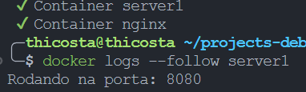
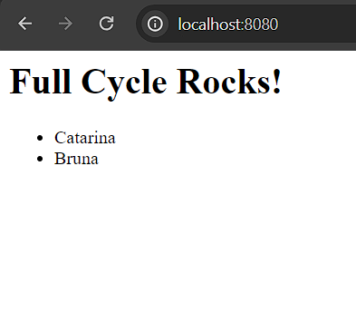

# Desafio 02 de Docker
## Requisitos do projeto
Nesse desafio você colocará em prática o que aprendemos em relação a utilização do nginx como proxy reverso. A idéia principal é que quando um usuário acesse o nginx, o mesmo fará uma chamada em nossa aplicação node.js. Essa aplicação por sua vez adicionará um registro em nosso banco de dados mysql, cadastrando um nome na tabela people.

O retorno da aplicação node.js para o nginx deverá ser:
```html
<h1>Full Cycle Rocks!</h1>
<ul>
  <li> Lista de nomes cadastrada no banco de dados.</li>
</ul>
```


Gere o docker-compose de uma forma que basta apenas rodarmos: docker-compose up -d que tudo deverá estar funcionando e disponível na porta: 8080.

Suba tudo em um repositório e faça a entrega.

* A linguagem de programação para este desafio é Node/JavaScript.

## Projeto
Foram feitos 3 arquivos Dockerfile:
* Dockerfile do mysql: arquivo de imagem mysql:5.7;
* Dockerfile do node.js: arquivo de imagem node distroless/nodejs18-debian11;
* Dockerfile nginx: arquivo de imagem nginx:stable-alpine para uso de proxy reverso.

### Aplicação rodando

* Aplicação rodando no servidor na porta 8080:



* Retorno da aplicação ao cliente que acessa via http://localhost:8080 ;




### Compose (buildar containers docker)
```bash
$ docker compose up -d --build
```


# Referências
* nodejs image: https://hub.docker.com/_/node/
* mysql image: https://hub.docker.com/_/mysql
* nginx image: https://hub.docker.com/_/nginx
* reduce nodejs images with distroless: https://github.com/GoogleContainerTools/distroless/tree/main/nodejs
* Configure nginx in node application using docker: https://ashwin9798.medium.com/nginx-with-docker-and-node-js-a-beginners-guide-434fe1216b6b
* Run node.js app with Nginx and docker: https://developer.redis.com/create/docker/nodejs-nginx-redis/